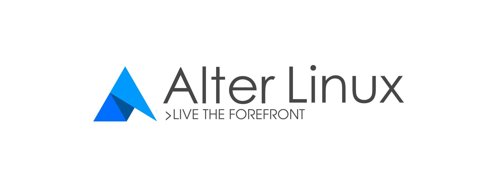

## Alter Linux - A Japanese-made Arch Linux-derived OS that aims to be usable by anyone



[](LICENSE)
[](https://https://www.archlinux.org/)
[](https://git.archlinux.org/archiso.git/tag/?h=v43)

| [日本語](README_jp.md) | [English](README.md) |
|:-----:|:-----:|

| [Stable](https://github.com/SereneTeam/alterlinux/tree/master) | [Unstable](https://github.com/SereneTeam/alterlinux/tree/dev-stable) | [Develop](https://github.com/SereneTeam/alterlinux/tree/dev) |
|:-----:|:-----:|:-----:|

## Overview
  
Alter Linux is a new OS developed based on Arch Linux.  
Combining a sophisticated UI with Xfce4 and a package management tool complete with a GUI, anyone can easily use the latest OS at high speed.  

## Repositories and software

### Repositories
- [SereneTeam/alter-repo](https://github.com/SereneTeam/alter-repo)  
All mirror servers are synchronized with this repository.  


### Software
The source code of the original software included in Alter Linux is below.
The first of all packages is [here](https://github.com/SereneTeam/alterlinux/blob/master/packages.x86_64).

- [EG-Installer](https://github.com/Hayao0819/EG-Installer)([PKGBUILD](https://github.com/Hayao0819/EG-Installer-PKGBUILD))
- [plymouth-theme-alter](https://github.com/yamad-linuxer/plymouth-theme-alter)([PKGBUILD](https://github.com/Hayao0819/plymouth-theme-alter))

The source code for software not in the AUR can be found below.

- [calamares](https://gitlab.manjaro.org/applications/calamares)([PKGBUILD](https://gitlab.manjaro.org/packages/extra/calamares))


## build

The following procedure is for building with the actual machine ArchLinux. 

### Preparation

There are two ways to build, using Arch Linux on the actual machine and building on Docker.
The options of `build.sh` are common.

#### Build on real machine
You need to build in ArchLinux environment.  
Please install `archiso` package beforehand.  

```bash
git clone https://github.com/SereneTeam/alterlinux.git
cd alterlinux
./build.sh
```


#### Build on container
If you build on Docker, please refer to [this procedure](Howtobuild_on_docker.md).  

### build.sh options

#### Basic
Please execute as it is.   
The default password is `alter`.   
Plymouth has been disabled.  
Default compression type is `zstd`.  


#### Options
- Enable Plymouth         ： `-b`
- Enable LTS kernel       : `-l`
- Change the password     ： `-p <password>`
- Change compression type : `-c <comp type>`
- Set compression options : `-t <options>`

Example: Enable Plymouth and change the password to `ilovearch` and change compression type to `gzip` and enable linux-lts.

```bash
./build.sh -l -b -p 'ilovearch' -c 'gzip'
```

##### About compression type
See the `mksquashfs` help for compression options and more options.
As of February 12, 2019, `mksquashfs` supports the following methods and options.

```
gzip (default)
    -Xcompression-level <compression-level>
    <compression-level> should be 1 .. 9 (default 9)
    -Xwindow-size <window-size>
    <window-size> should be 8 .. 15 (default 15)
    -Xstrategy strategy1,strategy2,...,strategyN
    Compress using strategy1,strategy2,...,strategyN in turn
    and choose the best compression.
    Available strategies: default, filtered, huffman_only,
    run_length_encoded and fixed
lzma (no options)
lzo
    -Xalgorithm <algorithm>
    Where <algorithm> is one of:
        lzo1x_1
        lzo1x_1_11
        lzo1x_1_12
        lzo1x_1_15
        lzo1x_999 (default)
    -Xcompression-level <compression-level>
    <compression-level> should be 1 .. 9 (default 8)
    Only applies to lzo1x_999 algorithm
lz4
    -Xhc
    Compress using LZ4 High Compression
xz
    -Xbcj filter1,filter2,...,filterN
    Compress using filter1,filter2,...,filterN in turn
    (in addition to no filter), and choose the best compression.
    Available filters: x86, arm, armthumb, powerpc, sparc, ia64
    -Xdict-size <dict-size>
    Use <dict-size> as the XZ dictionary size.  The dictionary size
    can be specified as a percentage of the block size, or as an
    absolute value.  The dictionary size must be less than or equal
    to the block size and 8192 bytes or larger.  It must also be
    storable in the xz header as either 2^n or as 2^n+2^(n+1).
    Example dict-sizes are 75%, 50%, 37.5%, 25%, or 32K, 16K, 8K
    etc.
zstd
    -Xcompression-level <compression-level>
    <compression-level> should be 1 .. 22 (default 15)
```


## About SereneTeam and developers
SereneTeam is a development team for a Linux distribution composed primarily of junior and senior high school students. Almost all are Japanese and there are a total of 24 members.  
[SereneLinux](https://serenelinux.com) based on Ubuntu has been developed and released.  
Utilizing our know-how, we are working on the development of Alter Linux, which is the first OS in Arch Linux to be developed in Japan.  

###  Twitter　account

#### Official
The following accounts are official.
- [Alter Linux](https://twitter.com/AlterLinux)
- [SereneLinux Global](https://twitter.com/SereneLinux)
- [SereneLinux JP](https://twitter.com/SereneDevJP)

#### Developer
Link to Twitter of main development members.  
All comments made on this account are not official SereneTeam statements and are solely for the developer.  

##### Development
- [Hayao0819](https://twitter.com/Hayao0819)
- [lap1sid](https://twitter.com/Pixel_3a)
- [yamad](https://twitter.com/_unix_like)

##### Design charge
- [tukutun](https://twitter.com/tukutuN_27)
