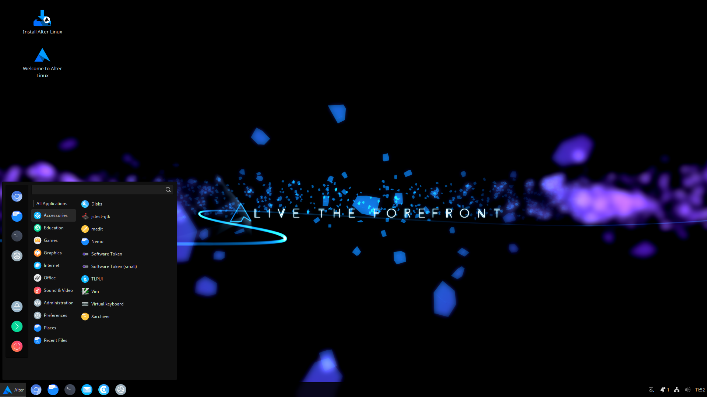
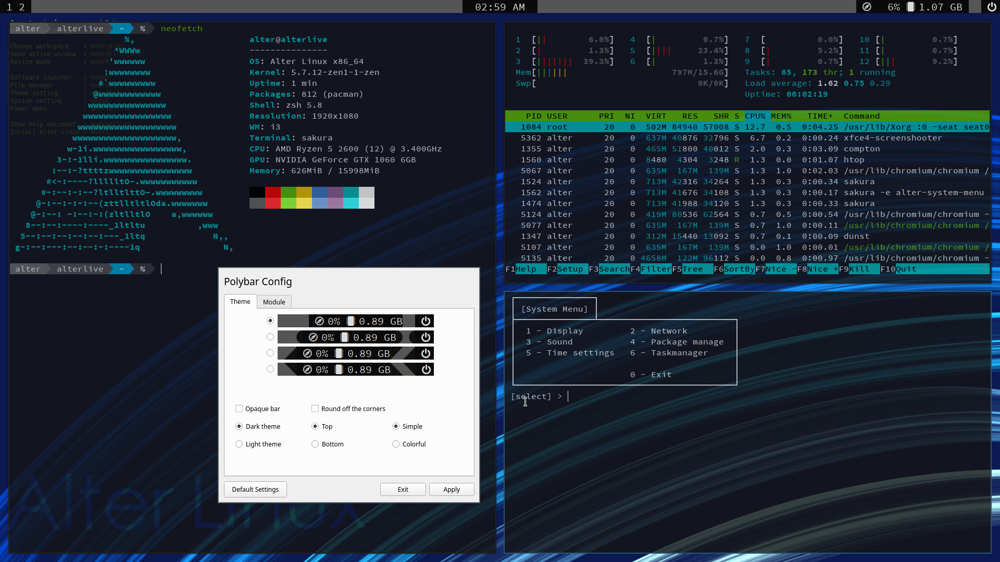

<h2>Alter Linux - Arch Linux-derived OS made in Japan aimed at anyone to use</h2>

    

    
    
    
    

	
	
	
	

	
	
	

<table>
    <thead>
        <tr>
            <th style="text-align:center">
                <a href="README_jp.md">日本語</a>
            </th>
            <th style="text-align:center">
                <a href="README.md">English</a>
            </th>
        </tr>
    </thead>
</table>

<b>
    日本語版は<a href="README_jp.md">こちら</a>にあります
</b>

<h2>〈Overview〉</h2>

Alter Linux is a new OS developed based on Arch Linux. 
Check the <a href="https://github.com/orgs/FascodeNet/projects/2">project board</a> for the latest status of Alter Linux. 
Please see the <a href="https://fascode.net/projects/linux/alter/">official website</a> for information on announcements and bugs for users.

<h3>Xfce</h3>

<h3>Lxde</h3>

<h3>Cinnamon</h3>

<h3>i3wm</h3>

<h2>〈Feature〉</h2>
<ul>
    <li>You can install the already built Arch Linux environment with GUI</li>
    <li>We release not only 64bit but also 32bit version.</li>
    <li>The 32-bit version does not require PAE (Physical Address Extension).</li>
    <li>Adopt ZEN kernel by default</li>
    <li>Equipped with sophisticated UI, themes, and icons</li>
    <li>You can use the syntax of <code>apt</code> with <code>aptpac</code></li>
    <li>Easy development of derived OS by framework based on archiso</li>
</ul>

<h2>〈Download〉</h2>
The image file can be downloaded from the official <a href="https://fascode.net/projects/linux/alter/#downloads">website</a>.
 
<b>We are looking for a mirror server provider for repositories and image file distribution.</b>
 
If you would like us to provide a mirror please contact the developer's Twitter.

<h2>〈Branch〉</h2>
These are a list of major branches. Other branches are temporary or used for specific purposes.

<table>
    <thead>
        <tr>
            <th>
                <a href="https://github.com/FascodeNet/alterlinux/tree/master">master</a>
            </th>
            <th>    
                <a href="https://github.com/FascodeNet/alterlinux/tree/stable">stable</a>
            </th>
            <th>
                <a href="https://github.com/FascodeNet/alterlinux/tree/dev-stable">dev-stable</a>
            </th>
            <th>
                <a href="https://github.com/FascodeNet/alterlinux/tree/dev">dev</a>
            </th>
            <th>
                <a href="https://github.com/FascodeNet/alterlinux/tree/alteriso-3-mainline">alteriso-3-mainline</a>
            </th>
        </tr>
    </thead>
    <tbody>
        <tr>
            <td>
                Most stable. Bug fixes may be delayed.
            </td>
            <td>
                Release candidate. Most bugs have been fixed.
            </td>
            <td>
                It is updated regularly. Relatively stable, with the latest features and fixes. *
            </td>
            <td>
                Always updated. There may be many issues left.
            </td>
            <td>
                Next-generation AlterISO and new desktop environment are being developed.
            </td>
        </tr>
    </tbody>
</table>

<h2>〈About opinion and impression〉</h2>
If Alter Linux doesn't start, is hard to use, or has any software you want installed by default, feel free to post it to <a href="https://github.com/FascodeNet/alterlinux/issues">Issues</a>. 
We are soliciting opinions from various users to make Alter Linux better. 

<h2>〈When submitting a bug report or pull request〉</h2>
Be sure to read <a href="CONTRIBUTING.md">CONTRIBUTING.md</a>.

<h2>〈Documents〉</h2>
Some documents may have outdated information or only some languages. 
All documentation can be found in <code>docs</code>. 
If you find a typographical error or a notation that isn't the case, please report it on Issues. 
<ul>
	<li><a href="en/BUILD.md">Build Alter Linux</a></li>
	<li><a href="en/SOFTWARE.md">About the source code of your own package</a></li>
	<li><a href="en/CHANNEL.md">Channel specifications</a></li>
	<li><a href="en/PACKAGE.md">Notes on package list</a></li>
	<li><a href="en/DOCKER.md">How to build on Docker</a></li>
	<li><a href="en/KERNEL.md">How to add a new kernel</a></li>
	<li><a href="en/CONFIG.md">About build configuration file</a></li>
	<li><a href="en/arch-pkgbuild-parser.md">About arch-pkgbuild-parser</a></li>
</ul>

<h2>〈If you cannot start〉</h2>
You can disable the boot animation and boot to see the logs. 
Boot from the disk and select <code>Boot Alter Linux without boot splash (x86_64)</code>. 
In addition, please write down the situation and model name <a href="https://github.com/FascodeNet/alterlinux/issues">here</a>, and report it to the developer.

<h2>〈About FascodeNetwork and developers〉</h2>
<a href="https://fascode.net/">Fascode Network</a> is a creative team mainly composed of students. 
We are developing <a href="https://fascode.net/projects/linux/alter/">Alter Linux</a> and <a href="https://fascode.net/projects/linux/serene/">SereneLinux</a>.

<h3>Official Twitter account</h3>

<h3>Developer Twitter account</h3>

