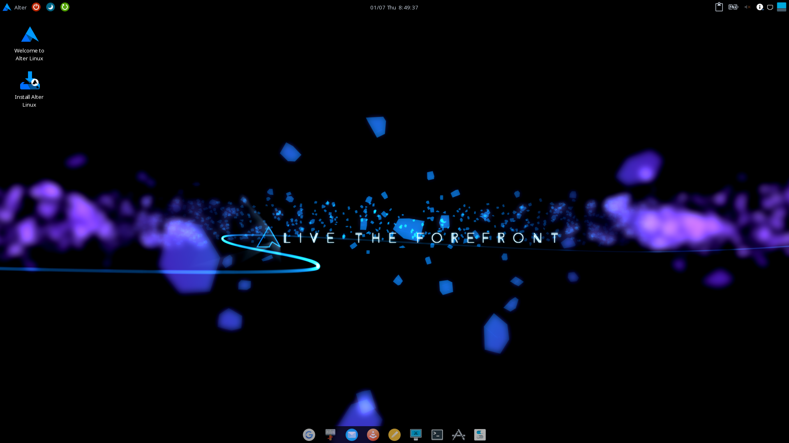
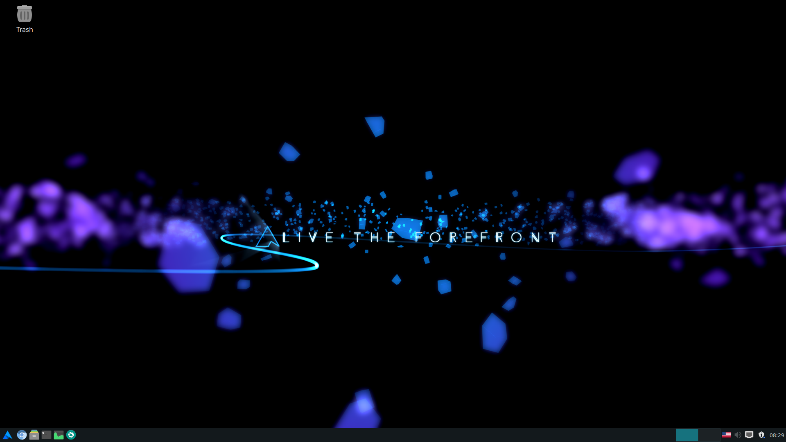
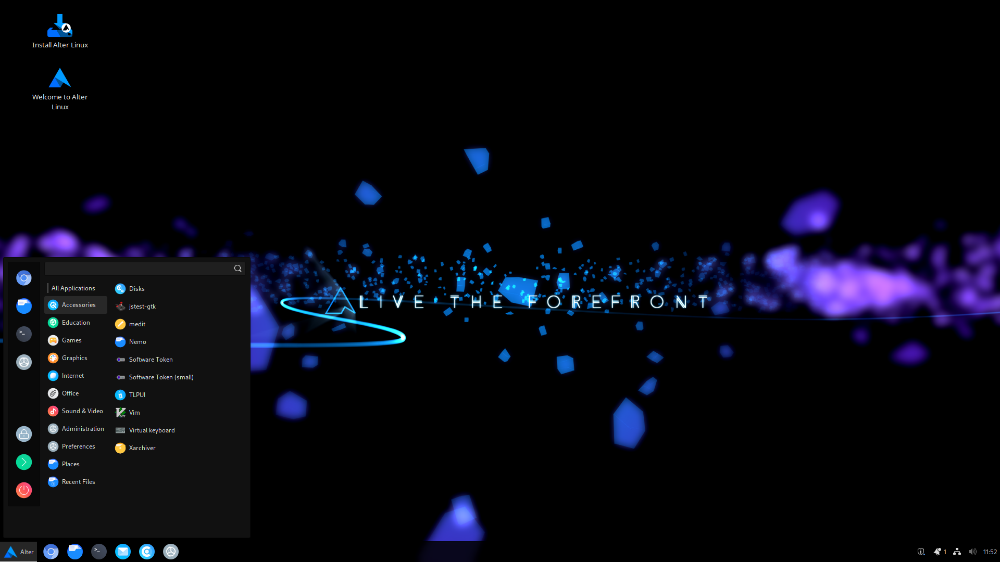
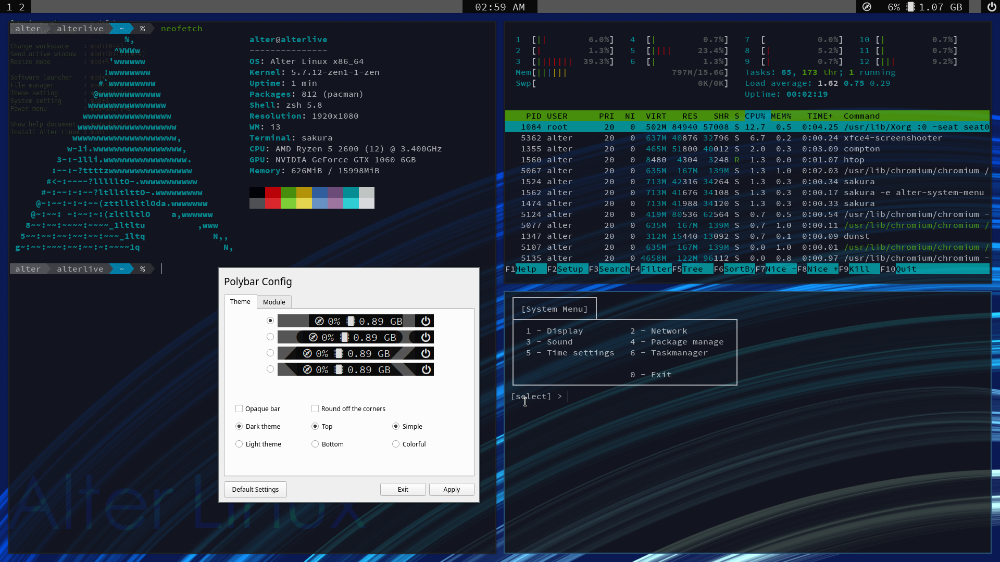

<h2 align="center">Alter Linux - 誰でも使えることを目標にした日本製でArch Linux派生のOS</h2>

	

	
	
	
	

	
	
	
	

	
	
	

<table>
	<thead>
		<tr>
			<th style="text-align:center">
				<a href="README_jp.md">日本語</a>
			</th>
			<th style="text-align:center">
				<a href="README.md">English</a>
			</th>
		</tr>
	</thead>
</table>

<h2>〈概要〉</h2>

Alter LinuxはArch Linuxをベースに開発されている新しいOSです。 
Alter Linuxの最新の開発状況は<a href="https://github.com/orgs/FascodeNet/projects/2">プロジェクトボード</a>を確認してください。 
ユーザ向けのアナウンスや不具合等の情報は<a href="https://fascode.net/projects/linux/alter/">公式サイト</a>をご覧ください。

<h3>Xfce</h3>

<h3>Lxde</h3>

<h3>Cinnamon</h3>

<h3>i3wm</h3>

<h2>〈特徴〉</h2>
<ul>
	<li>既に構築されたArch Linux環境をGUIでインストールできます</li>
	<li>64bitだけでなく、32bit(i686)もリリースしています</li>
	<li>32bit版はPAE（物理アドレス拡張）を必要としません。</li>
	<li>既に完全に日本語化されており、インストールしてすぐに日本語入力を使用できます</li>
	<li>デフォルトでZENカーネルを採用</li>
	<li>洗練されたUIやテーマ、アイコンを搭載しています</li>
	<li><code>aptpac</code>で<cpde>apt</code>の構文をそのまま使用できます</li>
	<li>archisoをベースとしたフレームワークにより簡単に派生OSを開発できます</li>
</ul>

<h2>〈ダウンロード〉</h2>
イメージファイルは<a href="https://fascode.net/projects/linux/alter/#downloads">公式サイト</a>からダウンロードできます。
 
<b>私達はリポジトリやイメージファイル配布用のミラーサーバ提供者を募集しております。</b>
 
もし私達にミラーを提供して頂ける場合は開発者のTwitterまでお願いします。

<h2>〈ブランチ〉</h2>
主要なブランチは以下のとおりです。これ以外のブランチは一時的なものや特定の用途で使われているものです。

<table>
	<thead>
		<tr>
			<th>
				<a href="https://github.com/FascodeNet/alterlinux/tree/master">master</a>
			</th>
			<th>	
				<a href="https://github.com/FascodeNet/alterlinux/tree/stable">stable</a>
			</th>
			<th>
				<a href="https://github.com/FascodeNet/alterlinux/tree/dev-stable">dev-stable</a>
			</th>
			<th>
				<a href="https://github.com/FascodeNet/alterlinux/tree/dev">dev</a>
			</th>
		</tr>
	</thead>
	<tbody>
		<tr>
			<td>
				最も安定しています。バグの修正などは遅れる場合があります。
			</td>
			<td>
				リリース候補です。ほとんどのバグが修正されています。
			</td>
			<td>
				定期的に更新されます。比較的安定していて、最新の機能や修正を利用できます。*
			</td>
			<td>
				常に更新されます。問題が多数残っている場合があります。
			</td>
		</tr>
	</tbody>
</table>

<h2>〈意見や感想について〉</h2>
もしAlter Linuxが起動しない、使いにくい、標準でインストールしてほしいソフトウェアがある、など意見がございましたらどうぞ遠慮なく<a href="https://github.com/FascodeNet/alterlinux/issues">Issues</a>まで意見をお寄せください。 
私達はAlter Linuxをより良いものにするために様々なユーザーの意見を募集しています。 

<h2>〈バグ報告やプルリクエストを送る際は〉</h2>
必ず<a href="CONTRIBUTING.md">CONTRIBUTING.md</a>を読んでください。

<h2>〈ドキュメント〉</h2>
一部のドキュメントは情報が古かったり、一部の言語しかない場合が有ります。 
また、全てのドキュメントは<code>docs</code>ディレクトリにあります。 
もし誤字脱字や実際と異なる表記を見つけた場合はIssuesで報告して下さい。 
<ul>
	<li><a href="jp/BUILD.md">Alter Linuxをビルドする</a></li>
	<li><a href="jp/SOFTWARE.md">独自のパッケージのソースコードについて</a></li>
	<li><a href="jp/CHANNEL.md">チャンネルに関する仕様</a></li>
	<li><a href="jp/PACKAGE.md">パッケージリストについての注意</a></li>
	<li><a href="jp/DOCKER.md">Docker上でビルドする方法</a></li>
	<li><a href="jp/KERNEL.md">新しいカーネルを追加する方法</a></li>
	<li><a href="jp/CONFIG.md">ビルドの設定ファイルについて</a></li>
	<li><a href="jp/CHANNEL_2_to_3.md">AlterISO2のチャンネルを3に対応させる</a></li>
	<li><a href="ja/arch-pkgbuild-parser.md">arch-pkgbuild-parserについて</a></li>
</ul>

<h2>〈起動できない場合〉</h2>
ブート時のアニメーションを無効化してブートし、ログを確認することができます。 
ディスクから起動し、<code>Boot Alter Linux without boot splash (x86_64)</code>を選択して下さい。 
また、発生した状況や機種名などを記載の上<a href="https://github.com/FascodeNet/alterlinux/issues">こちら</a>までご報告をお願いします。

<h2>〈FascodeNetworkと開発者について〉</h2>
<a href="https://fascode.net/">Fascode Network</a>は学生を主体とする創作チームです。 
<a href="https://fascode.net/projects/linux/alter/">Alter Linux</a>と<a href="https://fascode.net/projects/linux/serene/">SereneLinux</a>の開発を行っています。

<h3>公式Twitterアカウント</h3>

<h3>開発者Twitterアカウント</h3>

